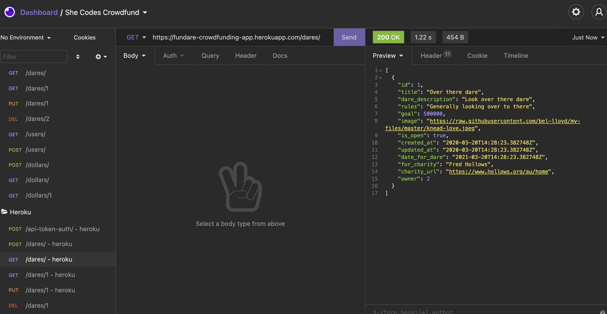
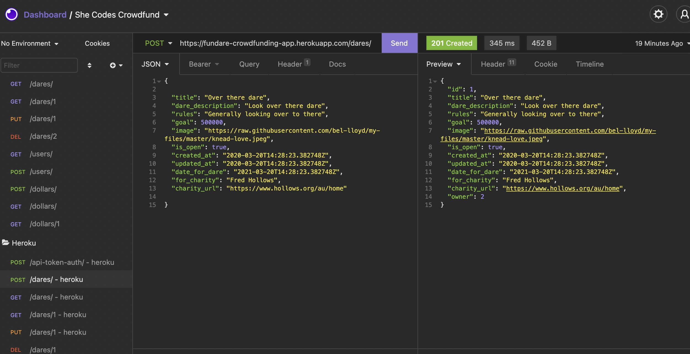
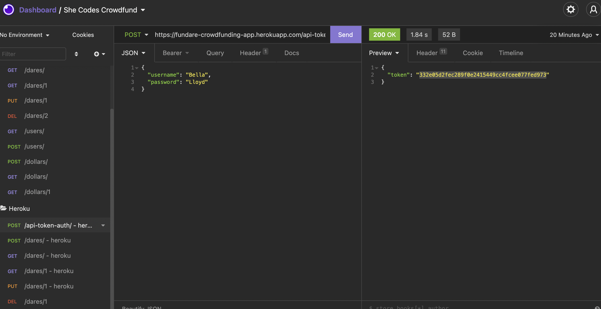

# fundare
Django Rest Framework crowdfunding app project. Introducing Fundare! Get your fave charities funded by Fun dares!

- PLEASE NOTE - I have used dares instead of projects and dollars instead of pledges.

See below for links;

## Links
- Link to [project brief](https://docs.google.com/document/d/1ocfmn1AmxYTIDKVRrycK2PQ4Fx3dnMd4JXgC0GE8csQ/edit?usp=sharing)
- Link to [Github repo](https://github.com/bel-lloyd/fundare)
- Link to [deployed project](https://fundare-crowdfunding-app.herokuapp.com/dares/)

## Screenshots

- Insomnia Screenshots
    - GET for Dares run on Heroku
    
    - POST for Dares fun on Heroku
    
    - AUTH TOKEN request from Heroku
    

## API Endpoints

1. Please reference API specs in [brief document here](https://docs.google.com/document/d/1ocfmn1AmxYTIDKVRrycK2PQ4Fx3dnMd4JXgC0GE8csQ/edit#)

## Future Considerations

Much more to come! Stay tuned!